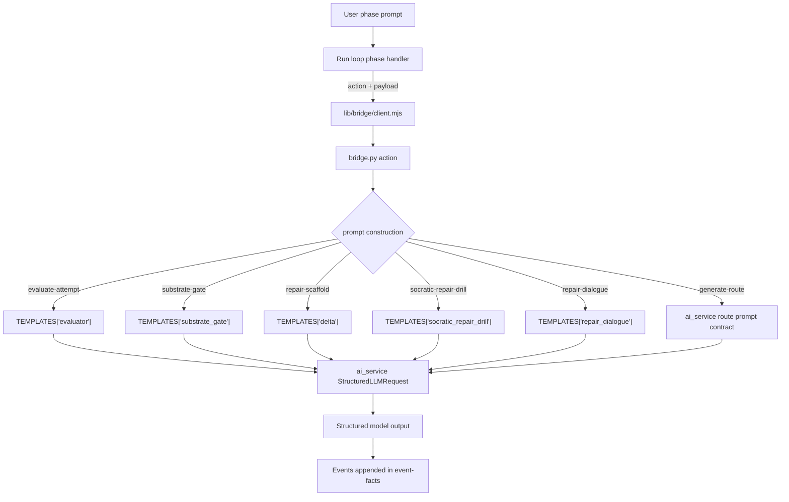

# Prompt Flow Map: How This App Uses AI

This map is scoped to the SEDA loop and only covers external LLM interactions.

## At runtime, AI is called in one place

- [lib/bridge/client.mjs](../lib/bridge/client.mjs) starts `bridge.py` as a subprocess for each `action`.
- [bridge.py](../bridge.py) builds the prompt for that action and calls
  `build_llm_client().generate_structured(...)` from the vendored AI seam.
- [prompt_templates.py](../prompt_templates.py) holds the app-owned templates for all non-route prompts.
- Route prompting is delegated to `ai_service.generate_smallest_provisional_map(...)` in `bridge.py`; the route template entry is a contract/version pin for parity tests.

## Prompted phases in the loop

| Loop phase (handler) | Bridge action | Template source | What is being generated |
| --- | --- | --- | --- |
| route | `generate-route` | `TEMPLATES['route']` (contract/version only; runtime text in `ai_service`) | Provisional map + first node |
| substrate_gate | `substrate-gate` | `TEMPLATES['substrate_gate']` | Route-readiness decision (graph-neutral) |
| cold_attempt | `evaluate-attempt` (`drill_mode=cold_attempt`) | `TEMPLATES['evaluator']` (+ mode) | Cold-attempt evidence classification + feedback |
| spaced_redrill | `evaluate-attempt` (`drill_mode=spaced_redrill`) | `TEMPLATES['evaluator']` (+ mode) | Spaced attempt classification + feedback |
| post_bridge_transfer | `evaluate-attempt` (`drill_mode=gap_drill`) | `TEMPLATES['evaluator']` (+ mode) | Post-bridge transfer check |
| delta | `repair-scaffold` | `TEMPLATES['delta']` | Gap scaffold (hinge focus, contrast prompt, before/after) |
| delta | `socratic-repair-drill` | `TEMPLATES['socratic_repair_drill']` | One Socratic repair question |
| repair / repair_recovery | `repair-dialogue` | `TEMPLATES['repair_dialogue']` | Repair-turn judge signal (`bridge_ready`, next action, progression state) |
| model_bridge / repair / spacing | no bridge action | — | Not prompt-driven in handler (state/events only) |

## Boundary notes

- Only handlers produce facts/events.
- `nextPhase(events)` owns routing; bridge payloads do not route directly.
- Most bridge results are **graph-neutral** unless they are `evaluate-attempt` outputs for
  score-eligible turns.
- If `log_raw_llm` is enabled, `llm_call.raw_prompt` is recorded with `system_prompt` + `user_prompt`.
